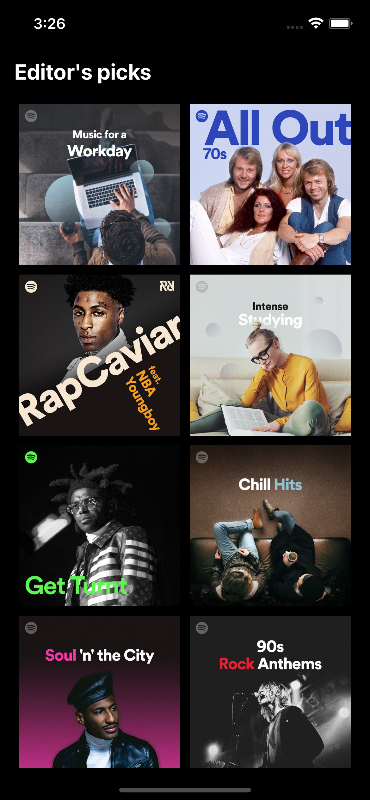
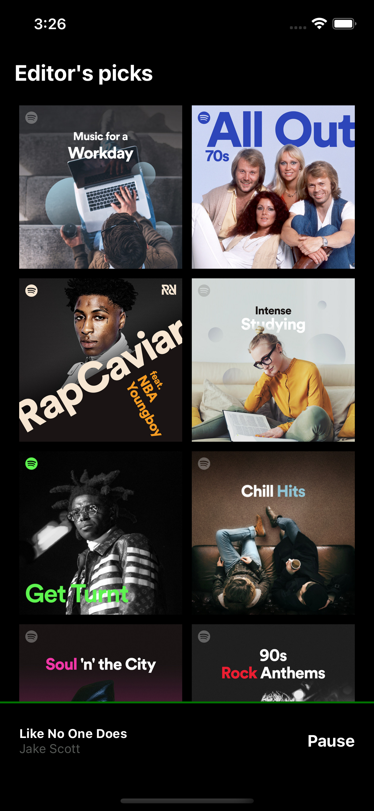
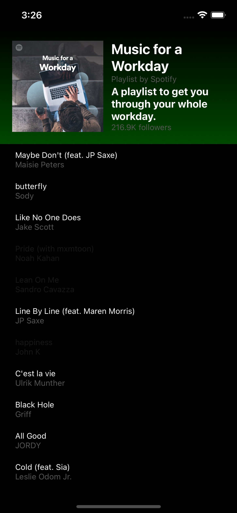
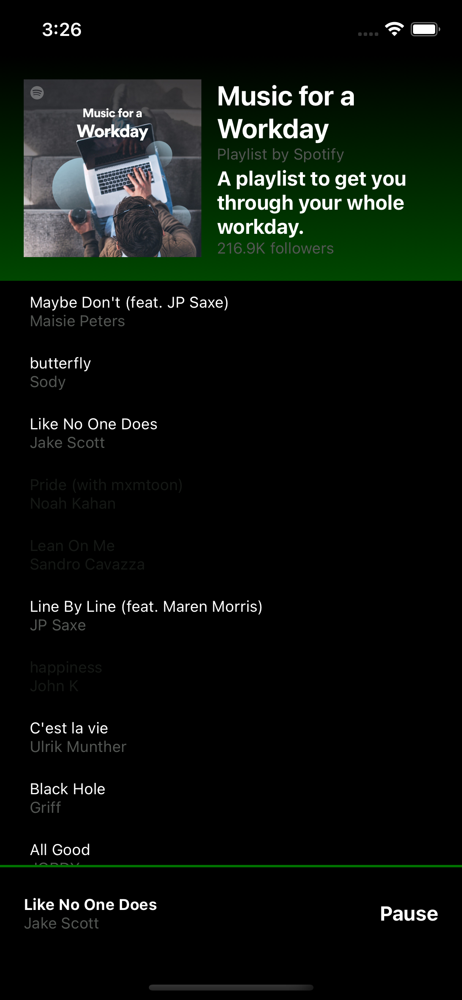

# react native spotify clone 🎸






## Description

A simple Spotify clone create for exercise built with React Native.

## Prerequisites

- Xcode
  - Install from the App Store
- Watchman
  - Install with `brew install watchman`
- JDK 8
  - Install using [SDKMAN](https://sdkman.io/)
- Android Developer Tools
  - Install with `brew cask install android-developer-tools`
- Node and Yarn
  - Install using [FNM](https://github.com/Schniz/fnm)
- React Native cli
  - Install with `npm install -g react-native-cli`
- Ruby and rbenv
  - Install with `brew install rbenv`
  - Add `eval "$(rbenv init -)"` to your `.zshrc`
  - Install Ruby with `rbenv install 2.7.2`
  - Set Ruby 2.7.2 as default with `rbenv global 2.7.2`

**Optional:** React Native will open a new Terminal window to run Metro bundler. If you want to open a iTerm tab instead, follow these instructions:

- Navigate to `app/node_modules/react-native/scripts/` (or create an empty file with the `.command` extension anywhere on your machine)
- Right click `launchPackager.command`
- Press the OPTION key
- Under "Always open with..." you can select iTerm
- Make sure to also click `Change All...` to keep this behavior in the future, otherwise you will have to repeat the operation every time you reinstall `node_modules`

## How to install

First, we need to install common versions of CocoaPods. To do so, in the root directory of the project run

```
bundle install
```

**N.B.:** We only need to do this when the `Gemfile` in the root folder gets updated.

### JavaScript dependencies

To install JavaScript dependencies for the app, run

```tsx
yarn;
```

### iOS Dependencies

install iOS dependencies with

```tsx
yarn pod:install
```

## Coding Style

I am using `Prettier` to enforce a common style over the components I didn’t add `husky` to prevent commit and apply prettier automatically

## run on iOS

After installing the pods and the javascript dependencies, go to the root of the project and run

```tsx
yarn ios
```

## run on Android

Should be able to run the code just by running

```tsx
yarn android
```

## Libraries

[Libraries used](./Libraries.md)
